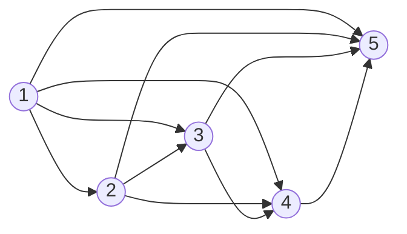
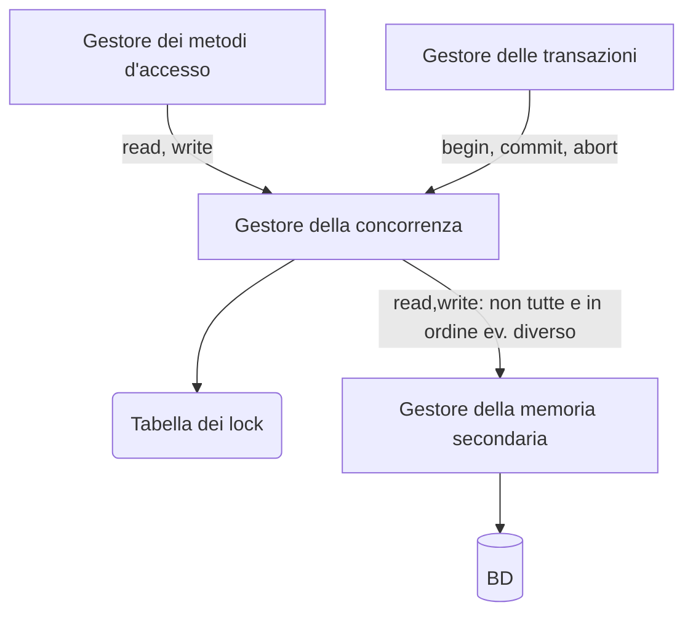
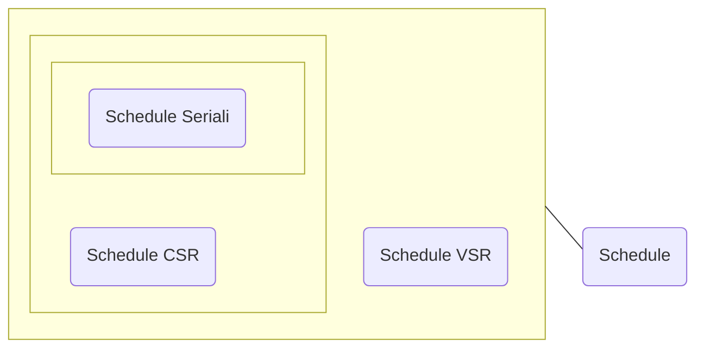

#uni 
La concorrenza è fondamentale, decine o centinaia di transazioni al secondo non possono essere seriali. Si appoggia sulla [[Gestione delle Transazioni]].
Senza una gestione accurata la concorrenza causerebbe però anomalie: per esempio se due transazioni operano sullo stesso valore possono leggere un valore intermedio "sporco".
Ci sono diversi tipi di anomalie:
- perdita di aggiornamento: W-W
  Quando una transazione aggiorna un valore senza sapere che anche un'altra transazione lo aggiorna.
- Lettura sporca: R-W o W-W con aborto
  Quando una transazione legge e opera su un valore che è stato aggiornato da una transazione che è stata poi abolita.
- Lettura inconsistente: R-W
  Quando una transazione ha due letture, che leggono valori diversi sullo stesso oggetto per via di un'altra transazione che cambia il valore in mezzo.
- Aggiornamento Fantasma: R-W
  Quando una transazione legge due valori sui quali vi è une vincolo di integrità, ma in mezzo vi è un aggiornamento corretto, quindi la base di dati soddisfa il vincolo, ma la transazione che legge i due valori non lo vede corretto.
  Ovvero si presenta quando ci sono due scritture di transazioni diverse di seguito, senza che la seconda scrittura abbia una relativa lettura dopo la prima scrittura.
- Inserimento fantasma: R-W su dato "nuovo"
# Scheduler
La componente del sistema di gestione della concorrenza che tiene traccia di tutte le operazioni elementari richieste ed eseguite sulla base di dati dalle transazioni, e che ha il compito di decidere se accettare o rifiutare le operazioni che vengono via via richieste si chiama ___scheduler___.
Tali decisioni devono garantire che non si creino anomalie, e che il mondo esterno abbia sempre l’impressione che l’esecuzione delle transazioni sia avvenuta in modo seriale, secondo un qualche ordinamento delle transazioni.
# Schedule
Uno schedule $S$ è una sequenza di operazioni di lettura/ scrittura di transazioni concorrenti.
Esempio: $S:r_1(x) \ \ r_2(z) \ \ w_1(x) \ \ w_2(z)$ dove $r_2(x)$ rappresenta la lettura dell'oggetto $x$ da parte della transazione $T_1$.
Le operazioni compaiono nello schedule nell'ordine temporale di esecuzione sul database.
### Schedule seriale
Uno schedule di transazioni $T=\{T_1,...,T_n\}$ è detto seriale se per ogni coppia di transazioni tutte le operazioni di una delle due sono eseguite prima di qualsiasi operazione dell'altra.
>Assumendo che ogni singola transazione mantenga il [[Database]] in uno stato consistente, concludiamo che ogni schedule seriale sia corretto.

Esempio: $T=\{T_0,T_1\} \to S = r_0(x) \ \ r_0(y) \ \ r_1(x) \ \ w_1(y)$ 
### Schedule Serializzabile
Per ragioni di prestazioni non possiamo permetterci di accettare solo schedule seriali, definiamo quindi gli schedule serializzabili.
Questo è un insieme di transazioni che produce lo stesso risultato di uno schedule seriale sulle stesse transazioni.
Questa definizione richiede però un concetto di equivalenza fra schedule.
### View-Equivalenza e View-Serializzabilità
Dato uno schedule $S$, il suo insieme ___scritture-finali___ $Finali(S)$ è composto da tutte le ultime scritture $w_i(x)$ di $S$ per un qualsiasi oggetto $x$ della base di dati.

Diciamo che esiste una relazione ___legge-da___ tra le operazioni $r_i(x)$ e $w_j(x)$ presenti in uno schedule $S$ se $w$ precede $r$ e se tra le due non ci sono altre $w$.
L'insieme _relazione legge-da_ è l'insieme di tutte le relazioni legge-da della schedule.

>Due schedule $S_i$ e $S_j$ sono detti ___view-equivalenti___, $S_i \approx_v S_j$ se hanno la stessa relazione __legge-da__ e le stesse __scritture finali__ su __ogni oggetto__.
Ovvero: $LeggeDa(S_1)=LeggeDa(S_2) \quad \land \quad Finali(S_1)=Finali(S_2) \implies S_1 \approx_v S_2$.

Uno schedule $S$ è ___view-serializzabile___ se è __view-equivalente__ ad un qualche schedule seriale con le stesse transazioni di $S$.

L'insieme degli schedule view-serializzabili è indicato con ___VSR___.

La verifica della _view-equivalenza_ di due dati schedule ha complessità polinomiale.
La verifica sulla _view-serializzabilità_ di uno schedule è un problema NP-completo poiché è necessario confrontare lo schedule con tutti i possibili schedule seriali, questo lo rende inutilizzabile nella pratica.
Poiché l'uso della view-serializzabilità nella pratica è impossibile definiamo una condizione di equivalenza più ristretta ma che sia utilizzabile nella pratica, quindi che abbia una complessità inferiore.
### Conflict-Serializzabilità
Un'operazione $a_i$ è ___in conflitto___ con un'altra operazione $a_j$ se operano sullo stesso oggetto e almeno una di esse è una scrittura. Nota bene: nei conflitti conta l'ordine.

Il conflitto può essere:
- R-W oppure W-R
- W-W

>Due schedule $S_i$ e $S_j$ sono detti ___conflict-equivalenti___, $S_i \approx_c S_j$ se hanno le stesse operazioni e ogni coppia di operazioni in conflitto compare nello stesso ordine in entrambi.

Uno schedule $S$ è ___conflict-serializzabile___ se è _conflict-equivalente_ ad un qualche schedule seriale.

L'insieme degli schedule _conflict-serializzabili_ è indicato con ___CSR___.

>___Teorema___: ogni schedule _conflict-serializzabile_ è _view-serializzabile_, ma non necessariamente viceversa, quindi $CSR \implies VSR$ poiché $\approx_c \implies \approx_v$.
### Verifica della _Conflict-Serializzabilità_
Si fa tramite il ___grafo dei conflitti___ ([[Grafo]]):
- Un __nodo__ per ogni __transazione__ $T_i$ 
- un __arco__ (orientato) da $T_i$ a $T_j$ se c'è almeno un __conflitto__ fra un'operazione $a_i$ e un'operazione $a_j$ tale che $a_i$ __precede__ $a_j$ 
__Teorema__: Uno schedule è in __CSR__ se e solo se ___il grafo è aciclico___.
	Esempio:
	-  S = $w_1(x) w_2(x) r_3(x) r_1(y) w_2(y) r_1(z) w_3(z) r_4(z) w_4(y) w_5(y)$
	-  $x : w_1 \, w_2 \, r_3$
	-  $y : r_1 \, w_2 \, w_4 \, w_5$
	-  $z : r_1 \, w_3 \, r_4$
	- Il grafo è aciclico $\to$ $S$ è **CSR**, quindi anche **VSR** 

La verifica di aciclicità di un grafo è polinomiale rispetto al numero dei nodi.
# Locking
I più diffusi algoritmi di scheduling delle transazioni si basano sul concetto di ___lock___.

>Un ___lock___ su un oggetto $x$ è un meccanismo di controllo della concorrenza che regola l'accesso simultaneo all'oggetto $x$.

I lock sono acquisiti e rilasciati dalle transazioni per mezzo dello scheduler.

Prima di eseguire una lettura sull'oggetto $x$, una transazione $T_i$ deve acquisirne il ___lock condiviso___, questa azione si indica con $rl_i(x)$. Dopo aver eseguito la lettura deve rilasciarlo: $ru_i(x)$.

Prima di eseguire una scrittura sull'oggetto $x$, una transazione $T_i$ deve acquisirne il ___lock esclusivo___ $wl_i(x)$. Dopo aver eseguito la scrittura deve rilasciarlo: $wu_i(x)$.

>Due _lock_ sullo stesso oggetto sono _in conflitto_ se almeno uno dei due è esclusivo.
### Locking Scheduler
Uno scheduler che inoltre gestisce le richieste di lock si chiama locking scheduler, a questo fine deve implementare un opportuno ___algoritmo di locking___, per l'assegnamento e il rilascio dei lock.
### Algoritmo 2PL
L'algoritmo di locking più diffuso nei [[DBMS]] è l'algoritmo di locking a due fasi, ___2PL___ (_two-phase locking_).

Questo si basa sulle seguenti regole:
1. Quando lo scheduler riceve un'operazione $p_i(x)$, controlla se il lock $pl_i(x)$ è in conflitto con qualche lock $ql_i(x)$ già acquisito da un'altra transazione sullo stesso oggetto.
   Se è in conflitto blocca l'operazione $p_i(x)$ e mette $T_i$ in attesa fino a quando non riesce ad acquisire il lock di cui ha bisogno.
   Quando il lock può effettivamente essere  rilasciato, assegna $pl_i(x)$ a $T_i$, che eseguirà l'operazione $p_i(x)$.
2. Lo scheduler non può rilasciare il lock $pl_i(x)$ almeno fino a quando l'operazione $p_i(x)$ si è conclusa.
3. ___Regola delle due Fasi___: una volta che lo scheduler ___rilascia___ un lock per una transazione, non può più assegnare nessun lock, su nessun oggetto, a quella transazione.

La terza regola divide ogni transazione in due fasi: la fase crescente e la fase calante. La sua funzione è quella di garantire che tutte le coppie di operazioni in conflitto di due transazioni siano schedulate nello stesso ordine.

>___Teorema $2PL \subset CSR$___: ogni schedule producibile da uno scheduler 2PL è conflict-serializzabile, ma non necessariamente viceversa.
### Algoritmo 2PL Stretto
Praticamente tutti gli scheduler 2PL usano una variante, detto ___2PL stretto___, in cui vi è una quarta regola: lo scheduler deve rilasciare tutti i lock di una transazione contemporaneamente, al termine della transazione stessa.

Questo perché la variante non stretta necessita che lo scheduler assumi quando vuole rilasciare un lock, che la transazione ha acquisito tutti i lock di cui aveva e avrà bisogno e che la transazione non eseguirà più nessuna operazione che coinvolge l'oggetto $x$.
### Implementazione attraverso Tabella dei Lock
Una possibile implementazione dei meccanismi di Lock è tramite la tabella dei lock, gestita da un componente del gestore della concorrenza chiamato ___Gestore dei Lock___.
Le operazione a disposizione per la tabella sono `lock(t,x,m)` e `unlock(t,x,m)`, dove `t` indica la relativa transazione, `x` l'oggetto e `m` la modalità del lock: condiviso o esclusivo.
L'esecuzione di una operazione `lock`: se il lock è assegnabile comporta l'inserimento nella tabella del lock, se non è assegnabile comporta l'inserimento di questa operazione in una lista di attesa.

L'implementazione di questa tabella dei lock è normalmente attraverso [[Tabella Hash]], per la sua estrema velocità di ricerca basata su contenuto.

Una coppia chiave-valore della tabella ha come chiave l'oggetto $x$ e come valore due liste: una prima lista di lock che sono stati concessi su $x$ e una seconda lista di richieste di lock su $x$.
Ogni Lock e richiesta di Lock contiene l'identificatore della transazione e la modalità del lock.
### Deadlock
Uno scheduler 2PL abbiamo detto che produce schedule conflict serializzabili, e quindi risolve tutte le anomalie risolte da schedule CSR, ne introduce però una nuova: il ___deadlock___.
Un deadlock è quando due o più transazioni sono ferme in attesa del rilascio di un lock, assegnato alle altre transazioni e quindi non rilasciabile.

Per risolvere questa anomalia impieghiamo la strategia del ___timeout___: se una transazione rimane in attesa di un lock più a lungo di un dato lasso di tempo prefissato (il valore di _timeout_) lo scheduler assume una situazione di deadlock e abortisce la transazione.

Un'altra strategia consiste nella certa identificazione dei deadlock, per poterlo fare lo scheduler mantiene aggiornato un grafo orientato detto ___grafo delle attese___, i suoi nodi sono le transazioni in esecuzione, un arco $T_i \to T_j$ rappresenta il fatto che la transazione $T_i$ è in attesa del rilascio di un lock assegnato alla transazione $T_j$, se in questo grafo è presente un ciclo, le transazione coinvolte nel ciclo sono in stato di _deadlock_, in questo caso allora lo scheduler sceglie una transazione e la abortisce, rimuovendo il nodo dal grafo e liberando il deadlock.
# Media

